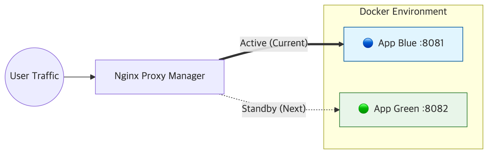
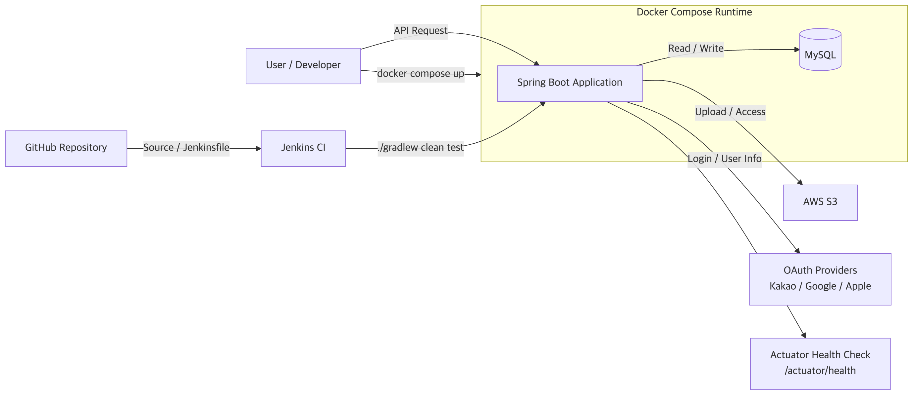
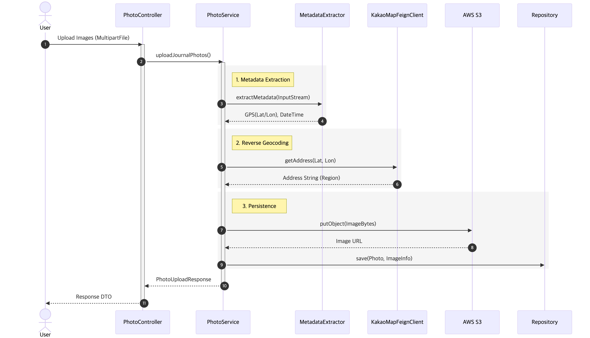
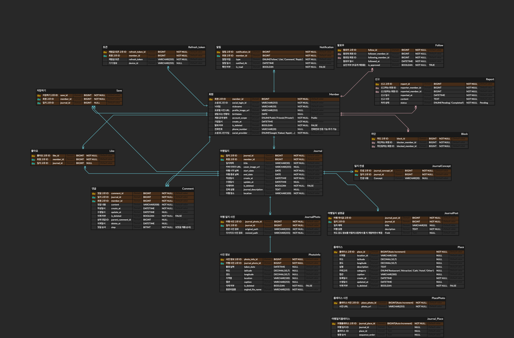
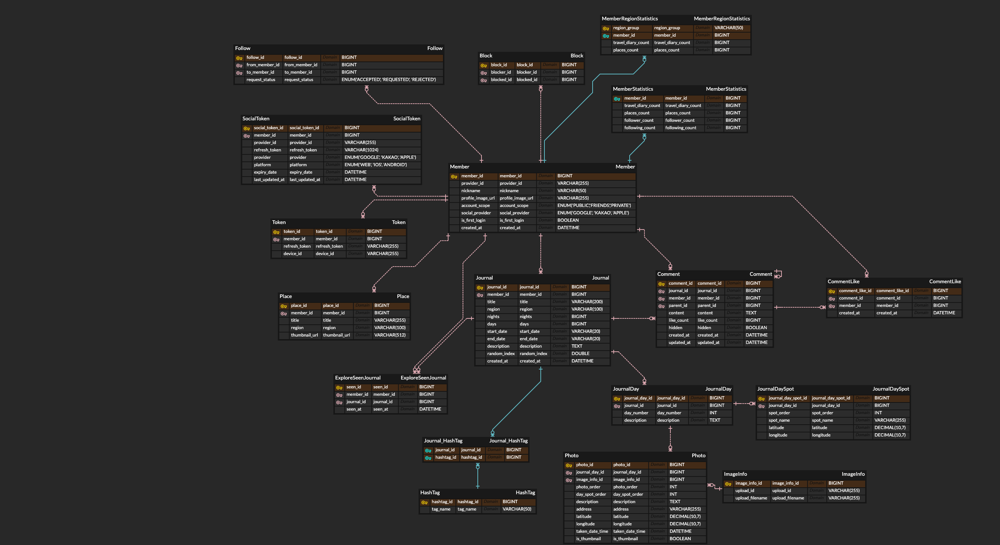
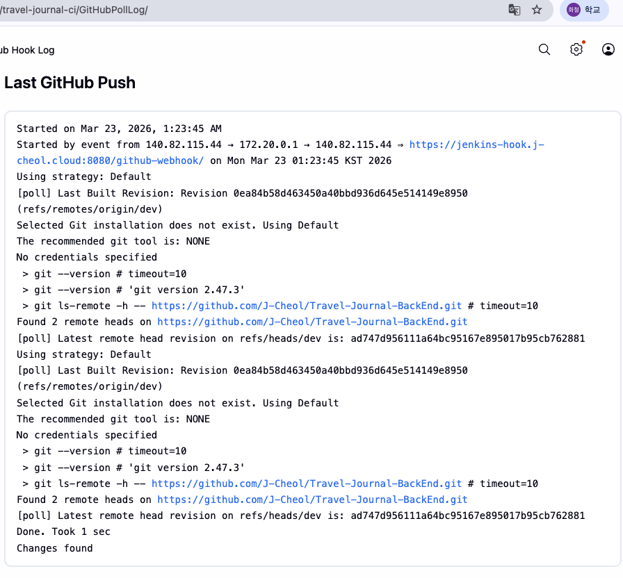
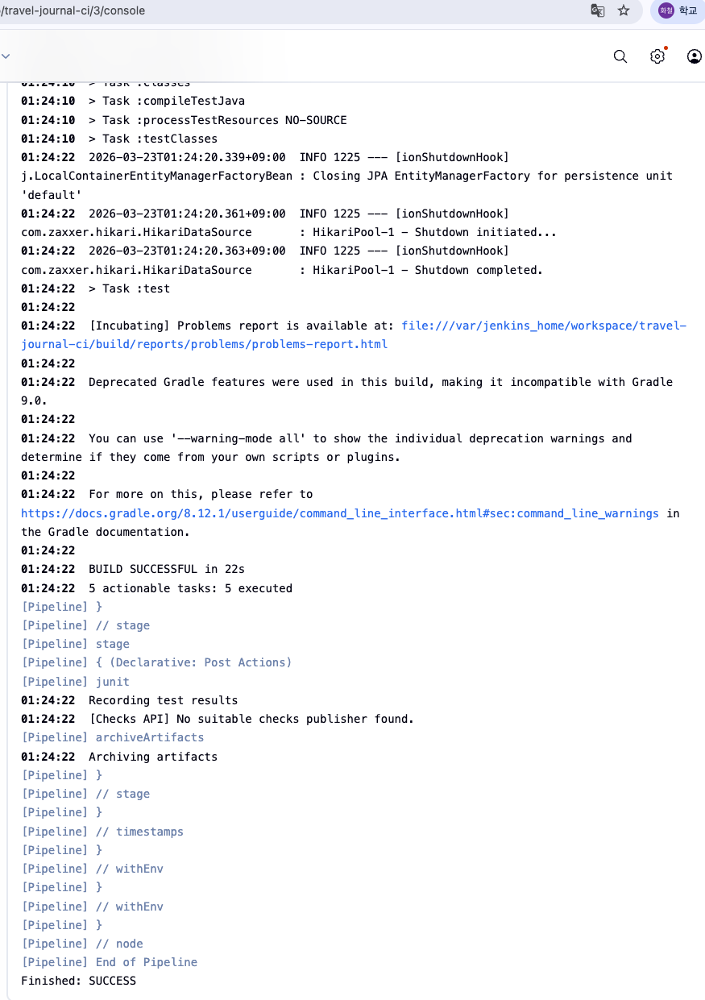

# Travel Journal Backend

> GPS 메타데이터 기반 여행 동선 자동화 및 소셜 큐레이션 플랫폼 백엔드 프로젝트

사진에 포함된 EXIF 메타데이터(GPS, 촬영 시간)를 기반으로 여행 동선을 자동으로 구성하고,  
팔로우 관계와 사용자 활동을 바탕으로 여행 콘텐츠를 탐색할 수 있도록 설계한 서비스입니다.

프로젝트 후반에는 백엔드 단독 리드 역할을 맡아 기능 마무리와 구조 안정화를 진행했고,  
포트폴리오 정리 과정에서 **테스트 코드, Jenkins CI, Docker Compose, Actuator 기반 Health Check**를 추가해  
운영 가능한 형태로 다시 정리했습니다.

---

## 목차

1. [프로젝트 개요](#프로젝트-개요)
2. [주요 기능](#주요-기능)
3. [팀 구성 및 역할](#팀-구성-및-역할)
4. [기술 스택](#기술-스택)
5. [시스템 아키텍처](#시스템-아키텍처)
6. [데이터 모델링](#데이터-모델링)
7. [핵심 구현 내용](#핵심-구현-내용)
8. [포트폴리오 정리 과정에서 추가한 내용](#포트폴리오-정리-과정에서-추가한-내용)
9. [실행 방법](#실행-방법)
10. [테스트](#테스트)
11. [브랜치 전략](#브랜치-전략)
12. [CI](#ci)
13. [Health Check](#health-check)
14. [트러블슈팅](#트러블슈팅)
15. [회고](#회고)
16. [다음 단계](#다음-단계)

---

## 프로젝트 개요

Travel Journal은 여행 사진에 포함된 GPS, 촬영 시각 정보를 활용해 여행 동선을 자동으로 구성하는 서비스입니다.  
사용자가 일정을 일일이 입력하지 않아도 사진 업로드만으로 여행 기록을 시작할 수 있도록 만드는 것이 핵심 아이디어였습니다.

단순 기록 서비스에 그치지 않고 아래 방향으로 확장했습니다.

- 여행일지 기반 콘텐츠 작성
- 장소/사진/여행일 단위 구조화
- 팔로우 기반 소셜 기능
- 탐색 피드 및 검색 기능
- 회원/지역 통계 기반 마이페이지 구성

### 진행 기간
- 2025.01 ~ 2025.08

### 개발 인원
- 총 8명
- Backend 2, Frontend 1, Design 1, Android 2, iOS 2

### 프로젝트 목표
- 사진 메타데이터를 활용해 여행 기록의 입력 부담 줄이기
- 여행 콘텐츠를 소셜 탐색 구조로 확장하기
- 여행일지 중심 데이터를 구조화해 확장 가능한 백엔드 설계 만들기

---

## 주요 기능

### 인증 / 회원
- Kakao 로그인
- Apple 로그인
- Google 로그인
- JWT 기반 인증 및 토큰 재발급

### 여행 기록
- 여행일지 생성 / 조회 / 수정 / 삭제
- 여행일 단위(`JournalDay`) 기록 관리
- 여행 경로 단위(`JournalDaySpot`) 저장
- 장소 기반 일정 구조화

### 사진 / 메타데이터
- 사진 업로드
- EXIF 메타데이터 파싱
- GPS / 촬영 시간 기반 여행 흐름 구성

### 소셜 기능
- 팔로우 / 팔로우 요청 / 차단
- 댓글 / 대댓글 / 좋아요
- 저장 기능

### 탐색 / 검색
- 탐색 피드
- 공개 범위, 차단 관계, 본인 게시물 제외 등을 반영한 피드 구성
- 회원 / 장소 / 여행일지 검색

### 통계 / 마이페이지
- 회원 통계
- 지역 기반 통계
- 여행일지 / 장소 / 팔로워 수 등 요약 정보 제공

---

## 팀 구성 및 역할

프로젝트는 초기에 8인 협업으로 시작했고,  
후반부에는 인원 이탈이 생기면서 **백엔드 개발과 안정화 작업을 사실상 단독으로 마무리**했습니다.

### 내 역할
**Backend Lead**

주요 기여 내용은 아래와 같습니다.

- Spring Boot 3.4 기반 백엔드 구조 설계
- OAuth2/JWT 인증 및 인가 흐름 정리
- 여행일지 / 장소 / 사진 메타데이터 처리 로직 구현
- 탐색 피드 및 검색 기능 구현
- 통계 구조 분리 및 데이터 모델 개선
- 프로젝트 후반 백엔드 단독 리드 및 안정화
- 포트폴리오 정리 과정에서 테스트 / CI / Docker / Health Check 추가

---

## 기술 스택

### Backend
- Java 17
- Spring Boot 3.4.2
- Spring Security
- Spring Data JPA
- OpenFeign
- Springdoc OpenAPI
- Spring Boot Actuator

### Database
- MySQL
- H2 (테스트 환경)

### Infra / DevOps
- Docker
- Docker Compose
- Jenkins

### External / Library
- AWS S3
- JWT
- Metadata Extractor
- Google / Kakao / Apple OAuth

---

## 시스템 아키텍처

이 프로젝트의 시스템 아키텍처는 두 관점으로 나누어 정리했습니다.

- **프로젝트 운영 당시 실제 배포 구조**
- **현재 공개 포트폴리오 레포 기준으로 재현 가능한 구조**

그리고 이 프로젝트의 핵심 차별점인 **이미지 기반 자동 기록 프로세스**를 별도 다이어그램으로 함께 정리했습니다.

### 1. 프로젝트 운영 당시 배포 아키텍처



프로젝트 운영 당시에는 AWS EC2 환경에서 **Docker 컨테이너 기반**으로 애플리케이션을 실행했고,  
**Nginx Proxy Manager**를 프록시 및 트래픽 진입 지점으로 사용했습니다.

배포 시에는 두 개의 애플리케이션 컨테이너를 번갈아 사용하는 **Blue/Green 방식**을 적용했습니다.

- **Blue(8081)**: 현재 사용자 요청을 처리하는 활성 버전
- **Green(8082)**: 다음 배포 버전을 올려두는 대기 버전
- 배포 검증이 끝나면 프록시 대상을 전환해 다운타임 없이 교체

이 구조를 통해 애플리케이션 재배포 시에도 서비스 중단 없이 버전을 교체할 수 있도록 구성했습니다.

---

### 2. 현재 포트폴리오 레포 기준 재현 가능한 아키텍처



현재 공개 포트폴리오 레포에서는 운영 당시 전체 배포 환경을 그대로 재현하기보다,  
**실제로 저장소에서 실행하고 검증할 수 있는 범위**를 기준으로 아키텍처를 정리했습니다.

현재 레포에서 재현 가능한 요소는 아래와 같습니다.

- `Jenkinsfile` 기반 테스트 자동화
- `Dockerfile`, `docker-compose.yml` 기반 실행 환경 표준화
- `application-test.yml` 기반 테스트 환경 분리
- `application-docker.yml` 기반 Docker 실행 환경 분리
- `spring-boot-starter-actuator` 기반 `/actuator/health` 제공
- Docker Compose `healthcheck`
- `scripts/health-check.sh` 기반 상태 검증

즉 운영 당시에는 **EC2 + Docker + Nginx Proxy Manager + Blue/Green 배포 구조**를 사용했고,  
현재 포트폴리오 레포에서는 **테스트, CI, 컨테이너 실행, Health Check까지 재현 가능한 형태**를 중심으로 정리했습니다.

---

### 3. 핵심 프로세스: 이미지 기반 자동 기록



이 프로젝트의 핵심 기능은 **사진 업로드만으로 여행 기록의 기초 데이터를 자동으로 구성하는 것**입니다.

동작 흐름은 아래와 같습니다.

1. 사용자가 여행 사진을 업로드합니다.
2. `PhotoService`가 업로드된 이미지의 메타데이터를 파싱합니다.
3. `MetadataExtractor`를 통해 EXIF 정보에서 **GPS 좌표, 촬영 시각**을 추출합니다.
4. 추출한 GPS 정보를 기반으로 `KakaoMapFeignClient`를 호출해 **역지오코딩(Reverse Geocoding)** 을 수행합니다.
5. 보정된 위치 정보와 메타데이터를 바탕으로 사진 정보를 정리합니다.
6. 원본 이미지는 **AWS S3**에 업로드합니다.
7. 이미지 URL과 메타데이터를 DB에 저장합니다.
8. 최종적으로 업로드 결과를 응답 DTO로 반환합니다.

---

## 데이터 모델링

### ERD 변화

초기 모델은 여행 흐름을 충분히 표현하기 어려웠고,  
프로젝트를 진행하면서 기록 구조와 통계 구조를 분리하는 방향으로 개선했습니다.

#### Before


#### After


### 데이터 모델링 핵심 변화

#### 1. 여행 경로 구조화
초기에는 여행일지를 단순 텍스트 중심으로 저장하는 구조에 가까웠습니다.  
이 방식으로는 “며칠 일정인지”, “어느 날에 어떤 장소를 갔는지”, “여행 경로가 어떤 순서인지”를 다루기 어려웠습니다.

그래서 아래 구조로 나눴습니다.

- `Journal`
- `JournalDay`
- `JournalDaySpot`

이렇게 분리하면서 여행일지 하나를 일자별, 장소별로 나눠 관리할 수 있게 되었고,  
여행 흐름을 더 자연스럽게 저장할 수 있게 되었습니다.

#### 2. 통계 데이터 분리
마이페이지 진입 시마다 팔로워 수, 여행일지 수, 장소 수 등을 실시간 집계하면  
읽기 시점의 비용이 커지고 구조도 복잡해집니다.

그래서 아래와 같이 통계 테이블을 분리했습니다.

- `MemberStatistics`
- `MemberRegionStatistics`

이를 통해 조회 시점에는 이미 계산된 값을 읽고,  
이벤트 발생 시점에만 통계를 갱신하는 방향으로 구조를 정리했습니다.

---

## 핵심 구현 내용

### 1. EXIF 기반 여행 흐름 구성
사진 메타데이터에서 GPS와 촬영 시간을 읽어 여행일지 구성에 활용했습니다.

이 작업의 핵심은 단순 업로드가 아니라,  
사진을 기반으로 여행의 흐름을 자동으로 기록 구조에 반영하는 것이었습니다.

### 2. 탐색 피드 정리
탐색 피드는 단순 최신순 목록이 아니라 아래 조건을 고려합니다.

- 공개 범위
- 차단 관계
- 본인 게시물 제외
- 이미 본 게시물 처리
- 정렬 및 탐색 경험

이 과정에서 단순 기능 구현이 아니라  
사용자 입장에서 피드가 어떻게 보일지를 기준으로 로직을 정리했습니다.

### 3. 통계 구조 분리
조회 시점마다 집계하지 않고 별도 통계 테이블을 두어,  
읽기 비용을 줄이고 마이페이지 응답 흐름을 단순화했습니다.

### 4. 후반 안정화
프로젝트 후반에는 새로운 기능을 늘리기보다,  
기존 기능이 안정적으로 동작하도록 구조와 설정을 정리하는 데 집중했습니다.

---

## 포트폴리오 정리 과정에서 추가한 내용

이 README에서 가장 강조하고 싶은 부분은  
**원래 만들었던 프로젝트를 운영 가능한 형태로 다시 정리했다는 점**입니다.

### 1. 테스트 코드 추가
기능 구현만 있는 상태에서 끝내지 않고,  
핵심 로직을 자동으로 검증할 수 있도록 테스트를 추가했습니다.

추가한 대표 테스트는 아래와 같습니다.

- `RegionNormalizerTest`
- `PaginationUtilsTest`
- `MemberRegionStatisticsServiceTest`
- `TravelJournalApplicationTests`

### 2. 테스트 환경 분리
초기에는 `contextLoads()`가 환경설정 누락 때문에 실패했습니다.  
이를 해결하기 위해 `application-test.yml`을 추가하고,  
`@ActiveProfiles("test")`를 적용해 테스트 전용 환경을 분리했습니다.

즉, **개발 환경과 테스트 환경을 분리해 CI에서도 동일하게 재현되도록 정리**했습니다.

### 3. Jenkins 기반 CI 구성
프로젝트 루트에 `Jenkinsfile`을 추가해 Jenkins에서 아래 흐름을 자동 실행하도록 만들었습니다.

- 코드 checkout
- `./gradlew clean test`
- JUnit XML 수집
- 리포트 보관

로컬에서만 테스트하던 흐름을 Jenkins에서도 반복 가능하게 만든 것이 핵심입니다.

### 4. Docker / Docker Compose 구성
`Dockerfile`, `docker-compose.yml`, `.env.example`, `application-docker.yml`을 추가해  
애플리케이션과 MySQL을 동일한 방식으로 실행할 수 있도록 정리했습니다.

이 과정을 통해 프로젝트는  
“내 컴퓨터에서만 되는 코드”가 아니라  
“누가 실행해도 비슷한 방식으로 뜨는 프로젝트”에 가까워졌습니다.

### 5. Actuator 기반 Health Check 추가
Actuator를 추가하고 `/actuator/health`를 통해 애플리케이션 상태를 확인할 수 있도록 했습니다.

여기에 더해:

- Docker Compose `healthcheck`
- `scripts/health-check.sh`

를 추가해 단순 프로세스 실행 여부가 아니라  
**실제 애플리케이션이 정상 상태(UP)인지**를 기준으로 검증하도록 정리했습니다.

### 6. 운영 경험과 현재 포트폴리오 범위
프로젝트 운영 당시에는 Docker 및 Nginx 기반 배포 구조를 적용한 경험이 있었지만,  
현재 공개 포트폴리오 레포에서는 **실제로 재현 가능한 범위**를 기준으로

- 테스트
- Jenkins CI
- Docker Compose
- Health Check

중심으로 정리했습니다.

즉 README에서도 “보여줄 수 있는 것”과 “경험은 있지만 현재 레포에서 직접 재현되진 않는 것”을 구분하려고 했습니다.

---

## 실행 방법

### 1. 로컬 실행

#### 사전 준비
- Java 17
- MySQL 8
- `src/main/resources/application-secret.yml`

현재 프로젝트는 기본 `application.yml`에서 `prod` 프로필을 기준으로 두고 있으므로,  
로컬 실행 시에는 `dev` 프로필을 명시적으로 지정하는 방식을 사용합니다.

#### 실행
```bash
./gradlew bootRun --args='--spring.profiles.active=dev'
```

또는 IntelliJ 실행 설정에서 아래 값을 추가해도 됩니다.

```text
SPRING_PROFILES_ACTIVE=dev
```

#### API 문서 확인
```text
http://localhost:8080/swagger-ui.html
```

---

### 2. 테스트

테스트는 아래 명령으로 실행합니다.

```bash
./gradlew clean test
```

테스트 환경은 `application-test.yml` 기준으로 분리되어 있으며,  
H2와 더미 설정값을 사용해 로컬 환경 차이를 줄였습니다.

---

### 3. Docker Compose 실행

#### 1) `.env` 생성
```bash
cp .env.example .env
```

`.env.example`은 공개 가능한 예시 파일이고,  
`.env`는 실제 실행에 사용하는 로컬 전용 파일입니다.

#### 2) 실행
```bash
docker compose up --build -d
```

#### 3) 상태 확인
```bash
docker compose ps
```

#### 4) 애플리케이션 로그 확인
```bash
docker compose logs -f app
```

#### 5) 종료
```bash
docker compose down
```

DB 볼륨까지 정리하려면:

```bash
docker compose down -v
```

---

## 테스트

현재 프로젝트에서는 핵심 로직을 자동으로 검증할 수 있도록 단위 테스트와 컨텍스트 로딩 테스트를 함께 구성했습니다.

### 주요 테스트
- `RegionNormalizerTest`
- `PaginationUtilsTest`
- `MemberRegionStatisticsServiceTest`
- `TravelJournalApplicationTests`

### 테스트 목적
- 지역명 정규화 로직 검증
- 페이징 유틸 검증
- 회원 지역 통계 서비스 로직 검증
- Spring Context 로딩 검증

---

## 브랜치 전략

- `dev`: 개발 및 통합 검증 브랜치
- `main`: 운영 반영 기준 브랜치

기능 작업은 개별 브랜치에서 진행한 뒤 `dev`로 통합하고,  
충분히 검증된 상태를 `main`으로 반영하는 흐름으로 브랜치를 운영했습니다.

---

## CI

프로젝트 루트의 `Jenkinsfile`을 기준으로 Jenkins Pipeline을 구성했습니다.

### Jenkins Pipeline 단계
1. Checkout
2. Gradle Test 실행
3. JUnit XML 수집
4. 테스트 리포트 보관

### Jenkins Webhook 기반 자동 테스트

초기에는 Jenkins에서 `Build Now`를 수동으로 실행해 테스트를 확인했지만,  
이후 GitHub Webhook과 `dev` 브랜치 기준 Job 설정을 통해  
`dev` 브랜치에 새로운 커밋이 push되면 Jenkins가 변경을 감지하고 자동으로 파이프라인을 실행하도록 구성했습니다.

구성 방식은 아래와 같습니다.

- Jenkins는 Synology 서버에서 상시 실행
- Jenkins UI는 Tailscale 내부 전용으로 접근
- GitHub Webhook은 별도 도메인(`jenkins-hook.j-cheol.cloud/github-webhook/`)으로 수신
- `travel-journal-ci` Job이 `dev` 브랜치를 기준으로 `Jenkinsfile`을 실행
- 파이프라인에서는 `./gradlew clean test`를 자동 수행

이를 통해 코드 변경 후 사람이 직접 Jenkins에서 실행 버튼을 누르지 않아도,  
`dev` 브랜치에 반영된 변경을 기준으로 자동 검증이 수행되는 CI 흐름을 만들었습니다.

#### GitHub Webhook 전달 확인


GitHub 저장소의 Webhook 설정에서 `push` 이벤트가 정상적으로 전달되는 것을 확인했고,  
이를 통해 Jenkins가 외부 이벤트를 받아 자동 검증을 시작하는 구조를 검증했습니다.

#### Jenkins 자동 빌드 성공 확인


Webhook으로 시작된 Jenkins 파이프라인이 `dev` 브랜치 기준으로 코드를 checkout하고,  
`./gradlew clean test`까지 정상 수행되어 `Finished: SUCCESS`로 종료되는 것을 확인했습니다.

### 의미
이전에는 로컬에서만 확인하던 테스트를 Jenkins에서도 반복 가능하게 만들었고,  
나아가 GitHub Webhook을 통해 `dev` 브랜치에 반영된 변경이 자동으로 검증되는 구조까지 확장했습니다.

---

## Health Check

### Actuator Endpoint 확인
```bash
curl http://localhost:8080/actuator/health
```

정상 응답 예시:

```json
{"status":"UP"}
```

### Liveness / Readiness 확인
```bash
curl http://localhost:8080/actuator/health/liveness
curl http://localhost:8080/actuator/health/readiness
```

### 스크립트로 확인
```bash
./scripts/health-check.sh
```

### Docker Health 상태 확인
```bash
docker inspect -f '{{.State.Health.Status}}' travel-journal-app
```

정상이라면 아래와 같이 표시됩니다.

```text
healthy
```

---

## 트러블슈팅

트러블슈팅은 두 가지 관점으로 정리했습니다.

- **프로젝트 구현 과정에서 겪은 문제**
- **포트폴리오 정리 과정에서 겪은 문제**

### 1. 프로젝트 구현 과정에서 겪은 문제

#### 1) 여행 흐름을 표현하기 어려운 데이터 구조
초기에는 여행일지를 하나의 단위로만 다루는 구조에 가까워,  
며칠 일정인지, 어느 날 어떤 장소를 방문했는지, 경로 순서를 어떻게 표현할지 정리하기 어려웠습니다.

##### 해결
- `Journal`
- `JournalDay`
- `JournalDaySpot`

구조로 분리해 여행일지 → 여행일 → 방문 장소 흐름을 단계적으로 저장하도록 모델링했습니다.

이를 통해 여행 기록을 단순 텍스트가 아니라  
**일정과 동선이 반영된 구조화된 데이터**로 다룰 수 있게 되었습니다.

#### 2) 마이페이지 통계 조회 구조 복잡도
회원 통계를 조회할 때마다 팔로워 수, 여행일지 수, 지역별 정보 등을 실시간 집계하면  
쿼리가 복잡해지고 응답 흐름도 무거워질 수 있었습니다.

##### 해결
통계성 데이터를 별도 테이블로 분리했습니다.

- `MemberStatistics`
- `MemberRegionStatistics`

이후에는 조회 시점마다 무거운 집계를 반복하기보다,  
변경 이벤트가 발생할 때 통계를 갱신하는 방향으로 구조를 정리했습니다.

#### 3) 탐색 피드 조건이 많아지면서 로직 복잡도 증가
탐색 피드는 단순 최신순 정렬이 아니라 공개 범위, 차단 관계, 본인 게시물 제외, 이미 본 게시물 처리 등  
여러 조건이 동시에 반영되어야 했습니다.

##### 해결
피드 조회 조건을 기능별로 정리하고,  
사용자 입장에서 피드에 노출되면 안 되는 조건을 먼저 걸러내는 방식으로 로직을 정돈했습니다.

이를 통해 단순 기능 구현이 아니라  
**서비스 정책이 반영된 피드 흐름**으로 정리할 수 있었습니다.

---

### 2. 포트폴리오 정리 과정에서 겪은 문제

#### 1) `contextLoads()` 실패
초기에는 `./gradlew clean test` 실행 시 `contextLoads()`가 실패했습니다.

##### 원인
전체 Spring Context를 로드하는 테스트인데,  
OAuth / JWT / AWS / datasource 관련 설정값이 충분하지 않아 Bean 생성이 실패했습니다.

##### 해결
- `application-test.yml` 추가
- `@ActiveProfiles("test")` 적용
- H2 및 더미 설정값으로 테스트 환경 분리

이후 로컬과 Jenkins에서 동일한 방식으로 테스트를 재현할 수 있게 됐습니다.

#### 2) 로컬과 Jenkins 간 테스트 차이
로컬에서는 통과하지만 Jenkins에서 실패하는 구간이 있었습니다.

##### 원인
Jenkins는 로컬 IDE 설정을 사용하지 않고 저장소 기준 설정만으로 테스트를 수행하기 때문에,  
환경 의존성이 그대로 드러났습니다.

##### 해결
- 테스트 전용 프로필 분리
- Jenkinsfile 기준 테스트 절차 고정
- 결과 리포트 수집 구조 추가

이를 통해 “내 로컬에서는 되는 테스트”가 아니라  
**CI에서도 반복 가능한 테스트 환경**으로 정리할 수 있었습니다.

#### 3) Docker 환경에서 “실행 중”과 “정상 상태”의 차이
컨테이너가 떠 있다고 해서 애플리케이션이 정상이라고 보장되지는 않았습니다.

##### 해결
- `spring-boot-starter-actuator` 추가
- `/actuator/health` 노출
- Docker Compose `healthcheck` 추가
- `scripts/health-check.sh` 추가

이후에는 단순 실행 여부가 아니라  
`status=UP` 기준으로 애플리케이션 상태를 검증할 수 있게 됐습니다.

---

## 회고

이번 프로젝트에서 가장 크게 배운 점은  
**기능 구현 자체보다, 그 기능을 신뢰할 수 있는 상태로 만드는 과정이 중요하다**는 것이었습니다.

처음에는 여행 기록, 사진 메타데이터, 피드, 댓글 같은 기능 구현이 중심이었지만,  
포트폴리오로 다시 정리하는 과정에서는 아래가 더 중요하게 느껴졌습니다.

- 테스트가 있어야 변경을 믿고 진행할 수 있다
- 환경을 분리해야 CI가 안정적으로 돈다
- Docker가 있어야 실행 방식이 표준화된다
- Health Check가 있어야 운영 관점에서 상태를 판단할 수 있다

결과적으로 이 프로젝트는  
단순한 기능 중심 백엔드 프로젝트를 넘어,  
**테스트, 자동화, 실행 표준화, 상태 검증까지 포함한 프로젝트**로 정리할 수 있었습니다.

---

## 다음 단계

앞으로는 아래 방향으로 더 확장해보고 싶습니다.

- Jenkins Pipeline에서 Docker 이미지 빌드까지 확장
- `main` 브랜치를 기준으로 한 운영 반영 흐름 정리
- Synology 상시 실행 환경에서 애플리케이션 배포 구조 고도화
- 파일 저장소 구조(S3 대체 또는 호환 스토리지) 검토